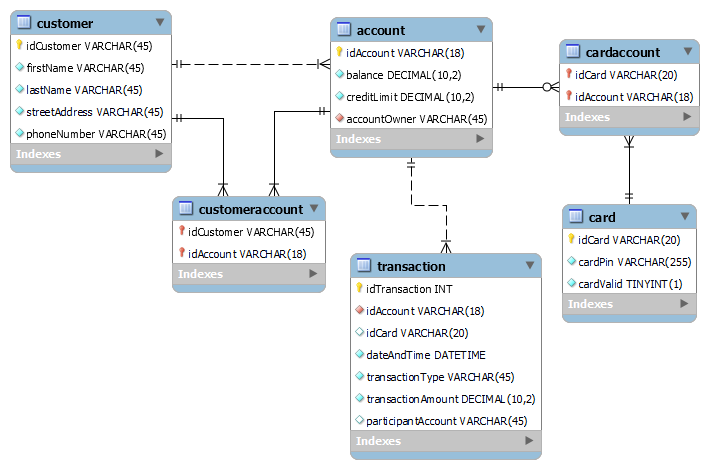

# pankkiprojekti

## Projektin kuvaus

Tässä projektissa rakennettiin pankkiautomaattisovellus. Sovellus sisältää seuraavat komponentit: 
<ol>
<li>MySQL-tietokanta </li>
<li>REST API (Node.js/Express.js)</li>
<li>Qt-sovellus</li>
</ol>

### Tietokannan ER-kaavio

Sovelluksen tietokanta on kuvattu allaolevassa ER-kaaviossa.

### REST API

REST API ohjelmoitiin käyttäen JavaScript ohjelmointikieltä.
REST API:ssa käytettiin Express.js frameworkkia. API toteutettiin noudattaen MVC-mallia. Autentikointi tapahtuu käyttäen JWT-autentikointia.

Tietokannassa olevaan card-tauluun kirjoitettava PIN-koodi salakirjoitetaan API:ssa käyttäen Bcrypt-salausalgoritmia.

### Qt-sovellus

Itse pankkiautomaatti rakennettiin käyttäen Qt-widgettejä. Sovelluksessa käytettiin Olimexin sarjaportinlukulaitetta.

Kun sovellus on käynnissä ja sarjaportinlukijaan laitetaan kortti, sovellus lukee kortilla olevan sarjanumeron ja kysyy PIN-koodin. Sen jälkeen sovellus lähettää API:lle http-requestin ja tällöin API tutkii vastaako sarjanumero ja PIN-koodi tietokannassa olevia arvoja. Mikäli annetut arvot vastaavat tietokannassa olevia, API palauttaa webtokenin.

Koska API:sa olevat endpointit vaativat autentikointia, on Qt-sovelluksen lähetettävä pyyntöjen mukana webtoken. Jos webtoken ei ole validi, API ei vastaa pyyntöön.

Jos sovellusta ei käytetä 30 sekunnin aikana, kaikki ikkunat lukuunottamatta aloitusikkunaa sulkeutuvat automaattisesti. Tämän toteutuksessa hyödynnettiin Singleton-suunnittelumallia.